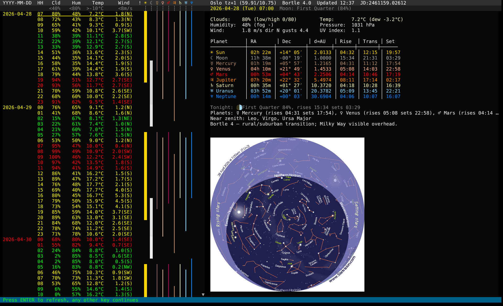
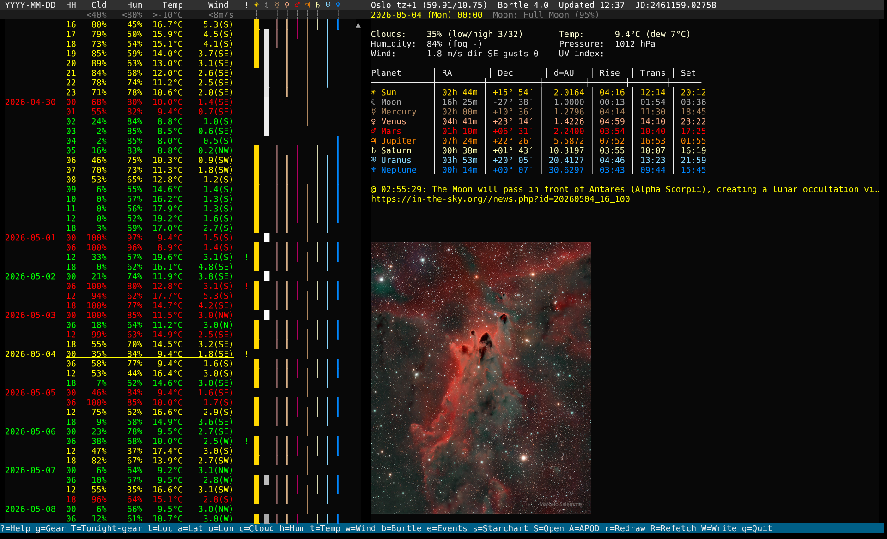
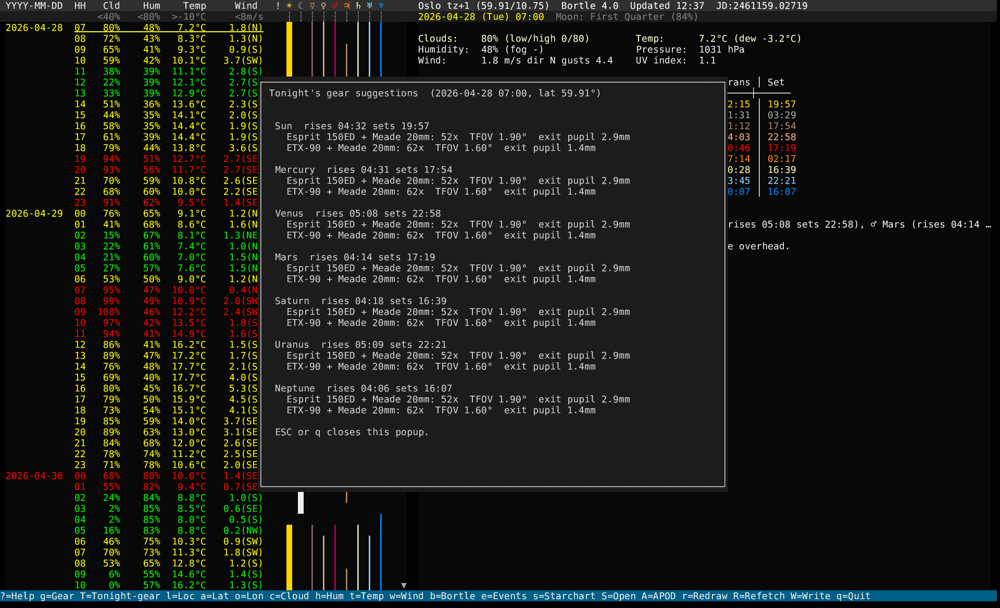

# Astro - Comprehensive Amateur Astronomy TUI



   

One-stop terminal app for amateur astronomers. Sky panel + telescope/eyepiece catalog in a single binary, sharing your location, Bortle rating, and conditions across both modes. Decides whether tonight is worth taking the telescope out for, then tells you which gear to grab.

Built on [crust](https://github.com/isene/crust) (TUI), with [glow](https://github.com/isene/glow) for inline images and [orbit](https://github.com/isene/orbit) for ephemeris. Rust merger of [astropanel](https://github.com/isene/astropanel) (Ruby) and [telescope-term](https://github.com/isene/telescope) (Ruby). Part of the [Fe₂O₃ Rust terminal suite](https://github.com/isene/fe2o3).

<br clear="left"/>

## Screenshots

Sky mode with the Stelvision starchart for the selected hour:



Sky mode with NASA's Astronomy Picture of the Day:



Cross-mode `T` popup: every currently-visible body × every telescope+eyepiece combination from your gear catalog, with magnification, true field of view, and exit pupil:



## Quick start

```bash
git clone https://github.com/isene/astro
cd astro
PATH="/usr/bin:$PATH" cargo build --release
ln -sf "$PWD/target/release/astro" ~/bin/astro
astro
```

First launch prompts for location and migrates `~/.nova/config.yml` and `~/.scope/data.json` if they exist, so users coming from the predecessors carry their settings forward.

Press `?` inside either mode for the full keybinding reference.

## Sky mode

Plan your observations with weather, ephemeris, and events.

- **9-day weather forecast** from [met.no](https://api.met.no/) with hourly detail, cached 3 hours.
- **Condition scoring** (green / yellow / red) per your cloud, humidity, temperature, wind limits.
- **Visibility bars** for Sun, Moon, Mercury, Venus, Mars, Jupiter, Saturn, Uranus, Neptune. One bar per hour, one column per body.
- **Moon phase** rendered as the Moon-bar shade (new = dark, full = bright).
- **Ephemeris table** (RA, Dec, distance, rise, transit, set) for all bodies, computed against the IAU 2006 obliquity standard via [orbit](https://github.com/isene/orbit).
- **Astronomical events** from the [in-the-sky.org](https://in-the-sky.org/rss.php) RSS feed, in-line with the hour bracket.
- **Tonight summary** fallback when there are no notable events: moon phase + rise/set, planets above the horizon, constellations near the zenith for the date and hemisphere, Bortle hint.
- **Starchart** from [Stelvision](https://www.stelvision.com/carte-ciel/) for the selected hour (cached per slot, only generated for latitudes above +23).
- **Astronomy Picture of the Day** ([NASA APOD](https://apod.nasa.gov/), cached per day).
- **Inline image display** via kitty / sixel / w3m / chafa.
- **Julian Date** in the header.
- **Async fetches** — background threads load events and images without blocking the UI.

## Gear mode

Catalog telescopes and eyepieces. Astro computes focal ratio, magnitude limit, min/max magnification, separation limits, recommended eyepiece focal lengths for different targets, exit pupil, true field of view, and more. Tag combinations to build observation logs.

Press `g` from Sky mode to enter Gear mode; `g` again to flip back.

### Telescope columns

| Col | Meaning |
|---|---|
| APP | Aperture (mm) |
| TFL | Focal length (mm) |
| F/? | Focal ratio (FL / APP) |
| <MGN | Magnitude limit (dimmest visible) — Bortle-adjusted from the Sky-mode setting |
| xEYE | Light gathering vs. the naked eye |
| MINx | Minimum usable magnification |
| MAXx | Maximum usable magnification |
| SEP-R / SEP-D | Rayleigh / Dawes separation limits (arcsec) |
| *FLD | Recommended eyepiece for star fields |
| GLXY | Recommended eyepiece for galaxies and nebulae |
| PLNT | Recommended eyepiece for planets and globular clusters |
| DBL* | Recommended eyepiece for planet details and double stars |
| >2*< | Recommended eyepiece for tight double stars |
| MOON | Smallest feature resolved on the Moon (m) |
| SUN | Smallest feature resolved on the Sun (km) |

### Eyepiece columns (per the currently-selected telescope)

| Col | Meaning |
|---|---|
| FL | Focal length (mm) |
| AFOV | Apparent field of view (degrees) |
| MAGX | Magnification |
| TFOV | True field of view (degrees) |
| PPL | Exit pupil (mm) |
| 2BLW | Magnification with a 2× Barlow lens |

## Cross-mode synergy

The merge unlocks features neither standalone app could:

- **`T` in Sky mode** opens a popup listing each currently-visible body × every telescope+eyepiece combo from the Gear catalog, showing magnification, TFOV, and exit pupil. Combos that exceed the scope's useful max magnification get a `⚠`.
- **Bortle-aware magnitude limit**: the `<MGN` column in Gear mode subtracts `(Bortle - 3) × 0.4` mag from the textbook dark-sky figure, so the displayed mag limit matches what you can actually see from your site. The applied Bortle is shown in the Gear mode header.
- **Observation log auto-fill** (`Ctrl-O` in Gear): the generated log file is prepopulated with date, location, time, weather, moon phase, visible planets, and Bortle from the Sky-mode snapshot taken when you pressed `g`.

## Sky-mode keys

| Key | Action |
|---|---|
| `?` | Help (centered popup) |
| `g` | Switch to Gear mode |
| `T` | Tonight's gear suggestions popup |
| `UP` / `DOWN`, `k` / `j` | Move row |
| `PgUP` / `PgDOWN`, `K` / `J` | Page |
| `HOME` / `END` | First / last hour |
| `e` | Show all upcoming astronomical events |
| `s` | Get starchart for the selected hour |
| `S` | Open starchart in external image viewer |
| `A` | Astronomy Picture of the Day |
| `ENTER` | Refresh current image |
| `r` | Redraw all panes |
| `R` | Refetch weather + events |
| `l` | Location name |
| `a` / `o` | Latitude / Longitude |
| `c` | Cloud limit (%) |
| `h` | Humidity limit (%) |
| `t` | Temperature lower limit (°C) |
| `w` | Wind limit (m/s) |
| `b` | Bortle scale (1–9) |
| `W` | Save config to `~/.astro/config.yml` |
| `ESC` | Reset status line |
| `q` / `Q` | Quit |

## Gear-mode keys

| Key | Action |
|---|---|
| `?` | Help (centered popup) |
| `g` | Back to Sky mode |
| `t` | Add telescope (name, aperture mm, focal length mm[, notes]) |
| `e` | Add eyepiece (name, focal length mm, AFOV°[, notes]) |
| `ENTER` | Edit selected |
| `TAB` | Switch focus (telescope ↔ eyepiece) |
| `UP` / `DOWN`, `k` / `j` | Move cursor |
| `Shift-UP` / `Shift-DOWN` | Reorder |
| `HOME` / `END` | Jump to start / end |
| `SPACE` | Tag / untag |
| `A` | Tag all |
| `u` | Untag all |
| `o` | Toggle sort (APP / FL) |
| `Ctrl-O` | Create observation log from tagged equipment (auto-filled with Sky-mode context) |
| `x` | Export tagged items to CSV |
| `X` | Export all items to JSON |
| `D` | Delete selected |
| `r` | Redraw |
| `v` | Show version |
| `ESC` | Reset status line |
| `q` / `Q` | Quit (save / no save) |

## Condition rules

Each forecast hour gets "negative points" based on your limits:

- 2 points if cloud cover > cloud_limit
- +1 point if cloud cover > (100 - cloud_limit) / 2
- +1 point if cloud cover > 90 %
- +1 point if humidity > humidity_limit
- +1 point if temperature < temp_limit
- +1 point if temperature < temp_limit - 7 °C
- +1 point if wind > wind_limit
- +1 point if wind > 2 × wind_limit

**0–1 = GOOD (green), 2–3 = FAIR (yellow), 4+ = BAD (red).**

## Configuration

`~/.astro/config.yml` (auto-created on first run; first launch also prompts for location):

```yaml
location: Oslo
tz_name: Europe/Oslo
lat: 59.91
lon: 10.75
tz: 1.0
cloud_limit: 40
humidity_limit: 80.0
temp_limit: -10.0
wind_limit: 8.0
bortle: 4.0
show_planets: true
show_events: true
```

- `location`: display name shown in the header
- `tz_name`: IANA timezone for the in-the-sky.org events feed (Cont/City format)
- `lat` / `lon`: observer position in degrees
- `tz`: UTC offset in hours (e.g. `1.0` for CET, `-5.0` for EST)
- `cloud_limit`, `humidity_limit`, `temp_limit`, `wind_limit`: thresholds for condition coloring
- `bortle`: light-pollution class for your site (1 = darkest, 9 = inner-city)

Other paths:

- `~/.astro/gear.json` — telescope and eyepiece catalog (JSON).
- `~/.astro/gear_config.json` — Gear-mode visual settings (colors, auto-backup count).
- `~/.astro/gear_backups/` — rotated catalog backups.
- `~/.astro/weather_cache.json` — weather cache (TTL 3 hours).
- `~/.astro/images/` — APOD per day, starchart per slot (cleaned to ~50 entries).

## Migration from nova / scope

On first launch astro looks for `~/.nova/config.yml` and `~/.scope/data.json` and copies them to the matching `~/.astro/` paths. The originals are left in place; you can delete them at your leisure.

The standalone [nova](https://github.com/isene/nova) and [scope](https://github.com/isene/scope) repos are archived in favour of this app.

## Requirements

- Linux or macOS, x86_64 or aarch64.
- `imagemagick` (`convert`) on `PATH` for inline image display.
- A terminal that speaks the kitty graphics protocol, sixel, w3m img, or chafa for inline images. Without any of those astro still runs but starcharts and APOD are unavailable inline (you can press `S` to open the starchart in your system image viewer instead).

## Data sources

- **Weather**: [api.met.no](https://api.met.no/) (Norwegian Meteorological Institute)
- **Events**: [in-the-sky.org](https://in-the-sky.org/rss.php) RSS feed
- **Starchart**: [stelvision.com](https://www.stelvision.com/carte-ciel/)
- **APOD**: [apod.nasa.gov](https://apod.nasa.gov/)
- **Ephemeris**: [orbit](https://github.com/isene/orbit), IAU 2006 obliquity standard, ported from [ruby-ephemeris](https://github.com/isene/ephemeris)

## Part of the Rust Terminal Suite (Fe₂O₃)

See the [Fe₂O₃ suite overview](https://github.com/isene/fe2o3) and the [landing page](https://isene.org/fe2o3/) for the full list of projects.

| Tool | Role |
|---|---|
| [rush](https://github.com/isene/rush) | Shell |
| [pointer](https://github.com/isene/pointer) | File manager |
| [kastrup](https://github.com/isene/kastrup) | Messaging hub |
| [scroll](https://github.com/isene/scroll) | Web browser |
| [tock](https://github.com/isene/tock) | Calendar |
| [hyper](https://github.com/isene/hyper) | HyperList outline viewer |
| [watchit](https://github.com/isene/watchit) | Movie / series browser |
| **astro** | Astronomy panel + gear catalog |

## License

Public domain ([Unlicense](https://unlicense.org/)).
